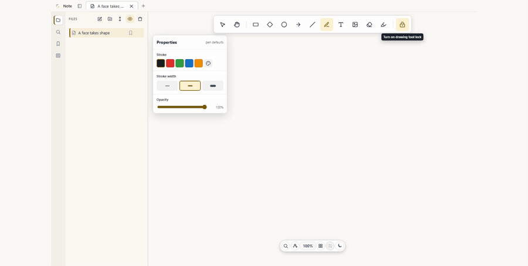

# Note

[](https://github.com/tyhuang9/note/releases/latest/download/Note-Setup.exe)
[](https://github.com/tyhuang9/note/releases/latest/download/Note.dmg)
[](https://github.com/tyhuang9/note/releases/latest/download/Note.deb)

Note is a local-first desktop workspace for arranging ideas on a freeform canvas.
Create pages, place text, images, and drawing elements, then keep working without
leaving your device.



## Install

Download a build from the [latest GitHub Release](https://github.com/tyhuang9/note/releases/latest).
Stable asset names make direct downloads convenient:

| Platform | Download | Install |
| --- | --- | --- |
| Windows | [Note-Setup.exe](https://github.com/tyhuang9/note/releases/latest/download/Note-Setup.exe) | Run it; the NSIS installer installs for the current user. |
| macOS | [Note.dmg](https://github.com/tyhuang9/note/releases/latest/download/Note.dmg) | Open it and drag Note into Applications. |
| Debian/Ubuntu | [Note.deb](https://github.com/tyhuang9/note/releases/latest/download/Note.deb) | Open it with your package installer, or run `sudo apt install ./Note.deb`. |
| Other Linux | [Release downloads](https://github.com/tyhuang9/note/releases/latest) | Use `Note.AppImage` when the release includes it. |

Current packages are unsigned. Windows SmartScreen and macOS Gatekeeper can
warn before opening them; verify that the download came from this repository.
See the [installation guide](docs/INSTALLATION.md) for platform-specific help,
updates, and source builds. The [documentation site](https://tyhuang9.github.io/note/)
offers the same download and first-use guide in the browser.

## Start using Note

1. Launch Note and create or select a page from the sidebar.
2. Click the canvas to add text; use the tools to draw, select, pan, and zoom.
3. Search pages and content from the sidebar, and switch themes from the app.

Your workspace is stored locally in Note's application-data directory. It is
not synced to a cloud service, so keep your own backups before replacing a
device or clearing application data.

## Develop locally

```bash
npm --prefix frontend ci
npm run dev
```

`npm run dev` opens the Tauri desktop app. For browser-only frontend work, use
`npm run web:dev`. Build a production package with `npm run tauri:build`.

## Releases

Pull requests and pushes to `main` validate native packages and keep the
normalized installers as Actions artifacts. Pushing a matching semantic tag
(for example `v0.1.0`) publishes those assets to GitHub Releases. Maintainers:
see [the release guide](docs/RELEASE.md).
